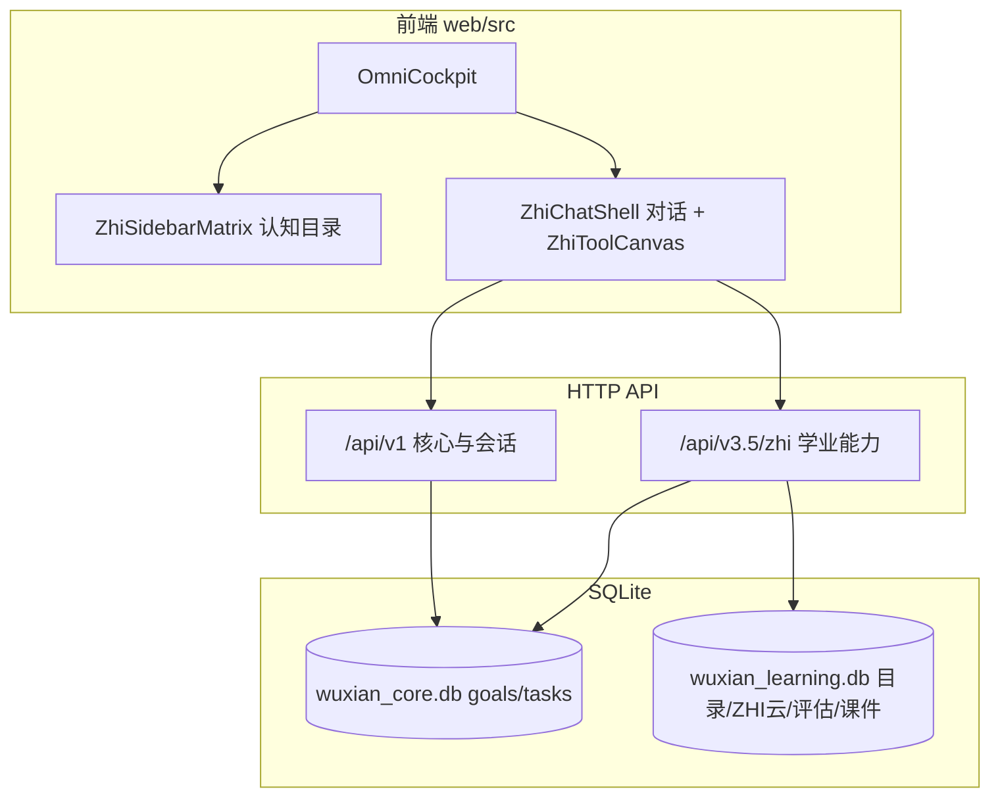

# WUXIAN 3.5 架构

产品版本 **`3.5.0`** · 主入口 **`/`（OmniCockpit）** · 默认端口 **`3401`**。

## 总览



## 前端分层（3.5 主壳）

| 模块 | 路径 | 职责 |
|------|------|------|
| 壳 | `OmniCockpit.tsx` | 鉴权 bootstrap、Provider 树、三栏布局 |
| 目录 | `ZhiSidebarMatrix` + `ZhiDirectoryContext` | 固定/自定义认知目录、梦校卡片 |
| 对话 | `ZhiChatShell` / `ZhiChatThread` / `ZhiComposer` | ZHI 消息、快捷操作、作战区卡片 |
| 工具 | `tools/zhi-tools.ts` + `ZhiToolCanvas` | 8 个注册工具（摄影/语言/视频/航标等） |
| 进度 | `LearningProgressContext`、成长条/教材条 | 与 v3.5 progress-dashboard 同步 |

**Hash 子路由**（`App.tsx`）：`#desktop-panel`、`#ghost-capture`（Electron 浮窗，不走主三栏）。

**已收敛**：根目录旧 `*.html` 已迁入 `legacy/static/`；存在 `web/dist` 时旧路径 **302 → `/`**。本地调试旧页：`WUXIAN_LEGACY_STATIC=1` 后访问 `/legacy/*.html`。

**已归档前端**：`web/src/_legacy/`（原 `CoreCockpit` 与 Omni 组件），勿从主壳 import。

## API 分层

| 命名空间 | 用途 | 鉴权（生产） |
|----------|------|----------------|
| `/api/v1/auth/*` | 会话 bootstrap、token | bootstrap 公开 |
| `/api/v1/goal/*`, `/api/v1/task/*` | 目标解构、重路由、今日任务 | 见 session-auth（阶段 B 将收紧写接口） |
| `/api/v1/wallet/*`, `/api/v1/payment/*` | 钱包、支付 | 部分需 Bearer |
| `/api/v3.5/zhi/*` | ZHI 学业主能力 | Bearer 必须 |
| `/api/v3.5/billing/*`, `/api/v3.5/cloud/*` | Warp 计费、云端目录/制品 | Bearer 必须 |
| `/api/v2/*`, `/api/v3/*` | 规划器、航标矩阵等 | Legacy，逐步废弃 |

完整 v3.5 路由列表见 [docs/api.md §4](./docs/api.md#4-zhi-platform-api-v35)。

## 数据存储

| 库文件 | 主要内容 |
|--------|----------|
| `wuxian_core.db` | `goals`, `tasks`, `reroute_logs`（能量斜率引擎） |
| `wuxian_learning.db` | 认知目录、梦校矩阵、语言/视频会话、课件库、学习评估、进化账本等 |

目录与目标通过 `goals.directory_id` ↔ `zhi_cognitive_directory.directory_id` 关联（跨库，无分布式事务）。

## 跨模块事件（前端）

跨模块事件统一见 `web/src/lib/wuxian-events.ts`：

- `WUXIAN_EVENTS` — 事件名常量
- `emitWuxianEvent` / `onWuxianEvent` — 类型化收发
- `emitDirectoryWorkspaceRefresh` — 同时刷新目录侧栏与作战区
- `openToolViaEvent` — 打开工具画布

`directory-workspace-api.ts` 再导出 `emitDirectoryWorkspaceRefresh` 以保持既有 import 路径。

## 启动链

```
server/index.ts
  → bootstrap-database()   # learning + 各 schema
  → createExpressApp()     # 静态 + v1 核心 + health
  → registerExtendedRoutes # auth/wallet/quantum/video…
  → registerWuxianV2/V3/V35Routes
```

版本常量单一来源：`server/product-version.ts`（health、启动 banner、package.json 对齐 **3.5.0**）。
